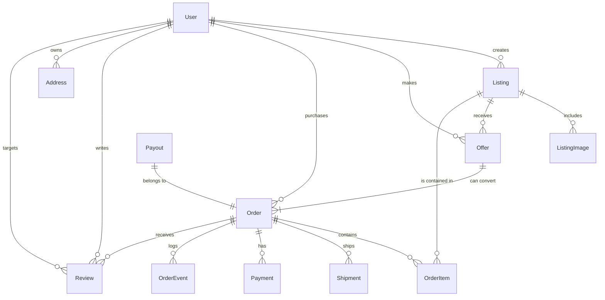

# Entity relationship diagram

The diagram highlights the primary relationships that power marketplace workflows:

- **Listings** have many images, offers, and order items. Sellers publish listings while buyers interact through offers or direct checkout.
- **Orders** aggregate one or more order items and track payments, shipments, and timeline events. Reviews connect buyers and sellers back to completed orders.
- **Payouts** are derived from fulfilled orders and link to financial reconciliation.
- **Addresses** are stored per user and reused for shipping or billing contexts.
